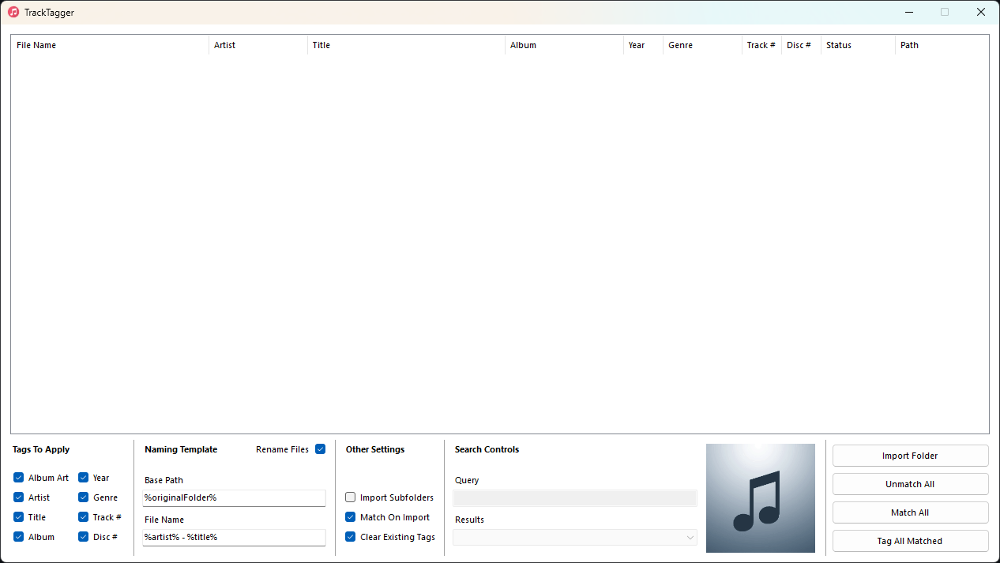

# TrackTagger

TrackTagger is a desktop application that can fetch and set metadata tags on audio files.

## Download

Downloadable builds are available on the [releases page](https://github.com/shibijm/tracktagger/releases).

## Supported Audio File Formats

- MP3
- FLAC
- M4A

## Metadata Source

- iTunes
